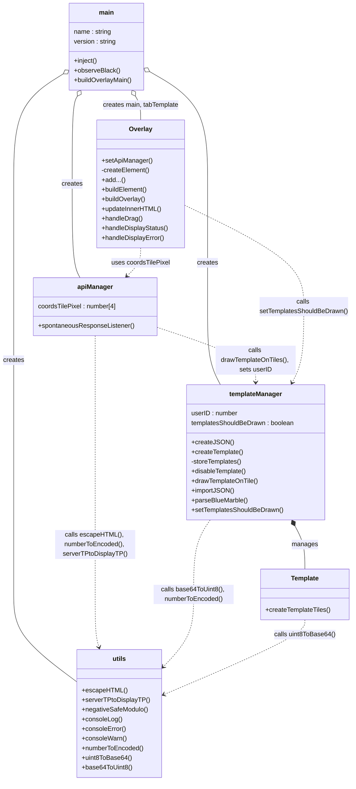
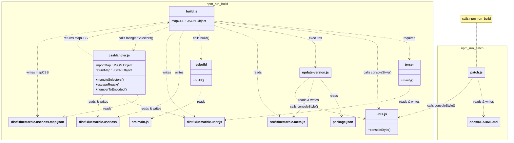

<table>
  <tr>
    <td><a href="#contributing">Đóng góp</a></td>
    <td valign="top" rowspan="99"></td>
  </tr>
  <tr>
    <td>&emsp;<a href="#summary">Tóm tắt</a></td>
  </tr>
  <tr>
    <td>&emsp;<a href="#why-follow-guidelines">Tại sao phải tuân theo hướng dẫn?</a></td>
  </tr>
  <tr>
    <td>&emsp;<a href="#what-can-i-contribute">Tôi có thể đóng góp gì?</a></td>
  </tr>
  <tr>
    <td>&emsp;&emsp;<a href="#programming">Lập trình</a></td>
  </tr>
  <tr>
    <td>&emsp;&emsp;<a href="#translation">Dịch thuật</a></td>
  </tr>
  <tr>
    <td>&emsp;&emsp;<a href="#everything-else">Mọi thứ khác</a></td>
  </tr>
  <tr>
    <td>&emsp;<a href="#what-can-i-not-do">Tôi không được làm gì?</a></td>
  </tr>
  <tr>
    <td>&emsp;<a href="#guidelines">Hướng dẫn</a></td>
  </tr>
  <tr>
    <td>&emsp;<a href="#our-mission">Sứ mệnh của chúng tôi</a></td>
  </tr>
  <tr>
    <td>&emsp;<a href="#how-to-contribute">Cách đóng góp</a></td>
  </tr>
  <tr>
    <td>&emsp;<a href="#production-enviroment">Môi trường sản xuất</a></td>
  </tr>
  <tr>
    <td>&emsp;&emsp;<a href="#npm-run">Npm Run</a></td>
  </tr>
  <tr>
    <td>&emsp;&emsp;<a href="#charts">Biểu đồ</a></td>
  </tr>
  <tr>
    <td>&emsp;<a href="#development-environment">Môi trường phát triển</a></td>
  </tr>
</table>

<h1 id="contributing">Đóng góp</h1>

  Cảm ơn bạn vì muốn đóng góp vào userscript "Blue Marble"! Điều đó có ý nghĩa rất lớn với tôi khi ai đó thích dự án của tôi đủ để muốn giúp nó phát triển. Nếu bạn chưa làm, hãy cân nhắc tham gia Discord của chúng tôi. Bạn có thể đặt câu hỏi về userscript ở đó và nhận phản hồi. Bạn cũng có thể truy cập <a href="https://bluemarble.lol/" target="_blank" rel="noopener noreferrer">trang web chính thức của Blue Marble</a> để biết thêm thông tin.
   
  <b>Lưu ý</b>: Nếu bạn đang sử dụng AI và muốn hướng dẫn AI cách các tệp trong codebase liên quan với nhau, hãy xem sơ đồ <code>Sơ đồ lớp quan hệ của Blue Marble</code> trong phần biểu đồ của tệp này. Sao chép biểu đồ và đưa nó cho AI.
   
  <b>Lưu ý</b>: Nếu bạn đang đóng góp vào tài liệu của dự án này, hãy tạo nhánh rẽ từ nhánh <code>documentation</code>. Nếu bạn đang đóng góp vào mã nguồn/lập trình của dự án này, hãy tạo nhánh rẽ từ nhánh <code>code</code>. Nếu bạn tạo nhánh rẽ từ main và tạo Pull Request từ <code>main</code> -> <code>main</code>, Pull Request của bạn có thể bị từ chối. Điều này là do <code>main</code> không được cập nhật và các thay đổi của bạn có thể xung đột với các thay đổi đã được cập nhật.

<h2 id="summary">Tóm tắt</h2>

  <ul>
    <li>Tôi không muốn lãng phí thời gian của bạn, vì vậy hãy kiểm tra lại với tôi trước khi bắt đầu một thay đổi lớn như thêm tính năng mới. Ví dụ, hãy tưởng tượng bạn dành 50 giờ để tạo một con bot tự động đặt pixel, sau đó pull request của bạn bị từ chối vì bot tự động đặt pixel không phù hợp với "Sứ mệnh" của Blue Marble. Điều đó thật đáng buồn :(</li>
    <li>Tuân theo phong cách của dự án. Ví dụ: nếu tất cả các lớp phủ được tạo bằng cách gọi <code>Overlay()</code> và bạn muốn tạo một lớp phủ mới, bạn cũng nên gọi <code>Overlay()</code>.</li>
    <li>Mã nguồn chất lượng thấp sẽ bị từ chối.</li>
    <li>Bạn có thể tìm tài liệu cho Blue Marble <a href="https://swingthevine.github.io/Wplace-BlueMarble/index.html" target="_blank" rel="noopener noreferrer">tại đây</a>.</li>
    <li>Đừng tạo nhánh rẽ từ nhánh <code>main</code>! Hãy tạo nhánh rẽ từ <code>code</code> hoặc <code>documentation</code>.</li>
    <li>Nếu bạn đang thêm một tính năng mới và khả thi để đưa tính năng của bạn vào bên trong một hàm, thì hãy sử dụng một hàm. Điều này sẽ làm cho mã của bạn ít xung đột hơn với mã của người khác. Hãy làm cho mã của bạn có tính <a href="https://en.wikipedia.org/wiki/Modular_programming" target="_blank" rel="noopener noreferrer">mô-đun</a>.</li>
  </ul>

<h2 id="why-follow-guidelines">Tại sao phải tuân theo hướng dẫn?</h2>

  Tuân theo các hướng dẫn trên trang này giúp ích cho tất cả mọi người. Viết mã tuân theo hướng dẫn:
  <ul>
    <li>Giúp tôi triển khai (và tiếp tục hỗ trợ) tính năng của bạn.</li>
    <li>Bạn có được tính năng của mình được triển khai.</li>
    <li>Mọi người khác nhận được một tính năng mới được hỗ trợ.</li>
  </ul>
  Đó là một kịch bản đôi bên cùng có lợi!

<h2 id="what-can-i-contribute">Tôi có thể đóng góp gì?</h2>
<h3 id="programming">Lập trình</h3>
  

    Phần lớn công việc cần làm trong userscript này liên quan đến lập trình. Có nền tảng về lập trình là hữu ích, nhưng không bắt buộc. Nếu bạn đang tìm cách học JavaScript và cú pháp của nó, hãy xem <a href="https://roadmap.sh/javascript" target="_blank" rel="noopener noreferrer">lộ trình học JavaScript này</a>. Chúng tôi đặc biệt khuyên bạn nên hiểu về hàm, phương thức, lớp và Lập trình hướng đối tượng nếu bạn dự định triển khai một tính năng hoàn toàn mới. Kiến thức kỹ thuật sâu hơn như method chaining và biểu thức lambda rất hữu ích nhưng không bắt buộc. Bạn có thể tìm tài liệu cho Blue Marble <a href="https://swingthevine.github.io/Wplace-BlueMarble/index.html" target="_blank" rel="noopener noreferrer">tại đây</a>. Hãy làm cho mã của bạn có tính mô-đun khi có thể. Nói cách khác, bạn nên "đóng hộp đen" mã của mình bằng cách đặt nó trong một hàm khi có thể. Ví dụ: nếu bạn đang thêm một bộ lọc màu để loại bỏ các màu không được hiển thị trên bản mẫu, hàm sẽ nhận thông tin bản mẫu và thông tin ô, đồng thời xuất ra thông tin bản mẫu/ô đã được lọc. Bằng cách này, mã của người khác không thể can thiệp vào bộ lọc màu. Ví dụ:
     
    <ol>
      <li>Hình ảnh bản mẫu được tạo và thông tin ô được truy xuất.</li>
      <li>Hàm bộ lọc màu được truyền vào hình ảnh bản mẫu và thông tin ô. Bộ lọc màu ghi đè hình ảnh bản mẫu bằng các màu đã lọc và xuất ra đó làm hình ảnh bản mẫu.</li>
      <li>Hàm đếm pixel được truyền vào hình ảnh bản mẫu đã sửa đổi và thông tin ô, và xuất ra số lượng pixel.</li>
      <li>Hình ảnh bản mẫu đã sửa đổi và thông tin ô được sử dụng để hiển thị bản mẫu.</li>
    </ol>
  

<h3 id="translation">Dịch thuật</h3>

  Mặc dù thường bị bỏ qua, dịch thuật là một cách mạnh mẽ để đóng góp cho một dự án. Nếu bạn có thể viết, có điều gì đó bạn có thể đóng góp! Từ lỗi ngữ pháp nhỏ đến dịch toàn bộ ngôn ngữ, mọi sự trợ giúp đều được đánh giá cao.

<h3 id="everything-else">Mọi thứ khác</h3>
  

    Mặc dù userscript tập trung vào lập trình, có rất nhiều cách để đóng góp! Từ cải thiện tệp README đến tạo hướng dẫn, bạn có thể đóng góp theo nhiều cách không yêu cầu kỹ năng lập trình. Ví dụ: nếu bạn có ý tưởng cho một tính năng nhưng không có kỹ năng để triển khai nó, hãy gửi yêu cầu tính năng! Ai đó có thể nhìn thấy nó, nghĩ rằng nó hay và triển khai nó.
  

<h2 id="what-can-i-not-do">Tôi không được làm gì?</h2>

  Vui lòng không sử dụng <a href="https://github.com/SwingTheVine/Wplace-BlueMarble/issues" target="_blank" rel="noopener noreferrer">GitHub Issues</a> để hỏi các câu hỏi hỗ trợ (ví dụ: "Làm cách nào để cài đặt cái này?" hoặc "<code>cssMangler</code> làm gì?"). Chúng tôi sử dụng trình theo dõi sự cố GitHub cho các báo cáo lỗi và yêu cầu tính năng. Nếu bạn đang gặp sự cố và cần trợ giúp, hãy hỏi trên <a href="https://discord.gg/tpeBPy46hf" target="_blank" rel="noopener noreferrer">Discord</a> của chúng tôi. <b>Tuy nhiên, bạn <i>nên</i> tạo một yêu cầu tính năng trên trình theo dõi sự cố của chúng tôi trước khi bắt đầu công việc đóng góp của bạn.</b> Không gì tệ hơn việc làm việc chăm chỉ cho một đóng góp chất lượng cao chỉ để bị từ chối vì nó không phù hợp với sứ mệnh của bản mod. Hãy hỏi trước!

  Vui lòng đóng góp một cách thiện chí. Chúng tôi sẽ từ chối các pull request có mã nguồn, nhận xét hoặc các pull request gây hại cho bản mod.

<h2 id="guidelines">Hướng dẫn</h2>
<ul>
  <li>Luôn gửi <a href="https://github.com/SwingTheVine/Wplace-BlueMarble/issues/new/choose" target="_blank" rel="noopener noreferrer">yêu cầu tính năng</a> và nhận sự cho phép để làm việc trên đóng góp của bạn <i>trước</i> khi bạn bắt đầu làm việc. Điều này sẽ tiết kiệm thời gian cho bạn nếu cuối cùng chúng tôi từ chối đóng góp. Các đóng góp nhỏ (như sửa lỗi chính tả) không cần yêu cầu tính năng.</li>
  <li>Tuân theo <a href="https://github.com/SwingTheVine/.github/blob/main/CODE_OF_CONDUCT.md" target="_blank" rel="noopener noreferrer">Quy tắc ứng xử</a>. Điều này bao gồm cả đóng góp của bạn và cách bạn tương tác với cộng đồng này.</li>
  <li>Luôn viết một thông điệp rõ ràng giải thích các thay đổi. "Thêm một số thứ" <i>không</i> giải thích những gì đã được thay đổi.</li>
  <li>Tính năng khác nhau, pull request khác nhau. Nếu bạn gửi một pull request cho bản mẫu và bản địa hóa (i18n) cùng nhau và chúng tôi muốn từ chối phần bản địa hóa, thì mã bản mẫu của bạn cũng bị từ chối cùng với phần bản địa hóa vì chúng nằm trong cùng một pull request. Chúng nên là các pull request riêng biệt vì chúng là các tính năng riêng biệt.</li>
  <li>Cấu trúc thư mục phải được duy trì (trừ khi bạn được phép thay đổi nó). Ví dụ: tất cả mã nguồn nên nằm trong `src/` và tất cả mã ảnh hưởng đến lớp phủ nên nằm trong tệp lớp Overlay.</li>
  <li>Cấu trúc đặt tên phải được duy trì (trừ khi bạn được phép thay đổi nó). Ví dụ: biến hình ảnh bản mẫu có thể được gọi là "templateDataImage." Hầu hết mọi thứ được đặt tên để được nhóm dựa trên điểm chung mà chúng có trước. Trong ví dụ trước, biến đầu tiên liên quan đến "template," sau đó là "data" là một "image." Điều này là do biến lưu trữ một hình ảnh đến từ dữ liệu của một bản mẫu. Lý do chính để đặt tên mọi thứ theo cách này là để giúp bạn khi bạn cố gắng tìm tên của một thứ gì đó. "Tôi cần hình ảnh của một bản mẫu, vì vậy biến có lẽ bắt đầu bằng 'template'".</li>
  <li>Mã của bạn phải được chú thích, giải thích mọi thứ làm gì. Chúng tôi có thể từ chối pull request nếu chúng tôi không hiểu mã làm gì.</li>
</ul>

<h2 id="our-mission">Sứ mệnh của chúng tôi</h2>

  "Sứ mệnh" của chúng tôi tạo nên bản chất của userscript này. Nếu không có nó, dự án này sẽ không tồn tại.

  Sứ mệnh của userscript này là cung cấp một lớp phủ bản mẫu mã nguồn mở, chất lượng cao, được tài liệu hóa đầy đủ.

  <ul>
    <li>Chúng tôi nhận thấy rằng hầu hết các lớp phủ canvas pixel không có mã nguồn mở chất lượng cao. Hoặc lớp phủ có chất lượng cao & mã nguồn đóng, hoặc lớp phủ có chất lượng thấp & mã nguồn mở. Userscript này cố gắng khắc phục điều đó.</li>
    <li>Chúng tôi nhận thấy rằng hầu hết các userscript lớp phủ canvas pixel đều bị làm rối mã. Mặc dù có thể sửa đổi chúng, nhưng điều đó khó khăn một cách không cần thiết. Userscript này hy vọng sẽ thay đổi tiền lệ bằng cách không bị làm rối mã.</li>
    <li>Chúng tôi nhận thấy rằng hầu hết các userscript lớp phủ canvas pixel không có đủ tài liệu để cho phép cộng đồng của họ sửa đổi (hoặc hiểu) hoạt động bên trong của lớp phủ. Userscript này cố gắng thân thiện với người mới bắt đầu nhất có thể.</li>
  </ul>

<h2 id="how-to-contribute">Cách đóng góp</h2>

  <ol>
    <li>Đọc tất cả <a href="https://github.com/SwingTheVine/Wplace-BlueMarble/blob/main/docs/CONTRIBUTING.md" target="_blank" rel="noopener noreferrer">các hướng dẫn đóng góp</a>.</li>
    <li>Nếu bạn muốn đóng góp, hãy gửi yêu cầu <a href="https://github.com/SwingTheVine/Wplace-BlueMarble/issues/new/choose" target="_blank" rel="noopener noreferrer">tại đây</a>.</li>
    <li>Nếu bạn đã nhận được sự cho phép để bắt đầu làm việc trên đóng góp của mình, hãy thiết lập môi trường phát triển trên thiết bị của bạn.</li>
    <li>Tạo nhánh rẽ của dự án.</li>
    <li>Tải nhánh rẽ của bạn xuống môi trường phát triển.</li>
    <li>Nếu có thể, sẽ rất hữu ích khi tìm hiểu cách một tính năng (đã có trong userscript) tương tự như đóng góp của bạn hoạt động. Ví dụ: nếu bạn muốn thêm một cửa sổ bật lên mới, sẽ có lợi khi tìm hiểu cách cửa sổ bật lên <code>Overlay</code> hoạt động.</li>
    <li>Thực hiện đóng góp của bạn.</li>
    <li>Cam kết vào nhánh rẽ của bạn.</li>
    <li>Gửi một pull request giữa nhánh rẽ của bạn và dự án này.</li>
  </ol>

<h2 id="production-enviroment">Môi trường sản xuất</h2>

  Dưới đây là thông tin có thể hữu ích cho những ai muốn sửa đổi Blue Marble.

  <h3 id="npm-run">Npm Run</h3>
  

    Chạy <code>npm run build</code> sẽ biên dịch Blue Marble. Các tệp đã biên dịch có thể được tìm thấy trong thư mục <code>dist/</code>. Chạy <code>npm run patch</code> sẽ tăng phiên bản vá và biên dịch Blue Marble.
  

  <h3 id="charts">Biểu đồ</h3>
  

    Sử dụng các nút mũi tên và thu phóng để điều hướng các biểu đồ. Sử dụng nút ↔️ để chuyển sang chế độ toàn màn hình. Sử dụng nút 🔄 để đặt lại. Tất cả các nút có thể được tìm thấy trên biểu đồ. Sử dụng biểu tượng "hai hình vuông" để sao chép biểu đồ. Nếu bạn cần hỗ trợ đọc biểu đồ, hãy sao chép biểu đồ vào một AI bằng nút "hai hình vuông" trên biểu đồ.
  

<!-- https://mermaid.js.org/syntax/classDiagram.html -->

Sơ đồ lớp quan hệ của Blue Marble:
(cập nhật lần cuối 0.74.0)

Sơ đồ lớp quan hệ của trình biên dịch/trình xây dựng của Blue Marble:
(cập nhật lần cuối 0.74.0)

<h2 id="development-environment">Môi trường phát triển</h2>

  Đây là những gì SwingTheVine sử dụng để lập trình Blue Marble. Bạn không cần phải sử dụng chính xác những thứ tương tự. Phần này được cung cấp để tham khảo.

  <h3>IDE</h3>
  Visual Studio Code 
  <code>Phiên bản: 1.102.3</code> 

  <h3>Trình duyệt</h3>
  Google Chrome 
  Phiên bản: <code>138.0.7204.184 (Bản chính thức) (64-bit)</code> 
  TamperMonkey Phiên bản: <code>5.3.3</code>

  <h3>Hệ điều hành</h3>
  Windows 10 Home 
  Phiên bản: <code>22H2</code> 
  Bản dựng HĐH: <code>19045.6093</code> 
  Bộ xử lý: <code>Intel Core i7-9750H CPU @ 2.60GHz</code> 
  RAM: <code>16.0 GB</code> 
  Bộ nhớ: <code>932 GB SSD Samsung SSD 970 EVO Plus 1TB, 238 GB SSD HFM256GDJTNG-8310A</code> 
  Card đồ họa: <code>NVIDIA GeForce GTX 1660 Ti (6 GB)</code> 
  Loại hệ thống: <code>Hệ điều hành 64-bit</code>

