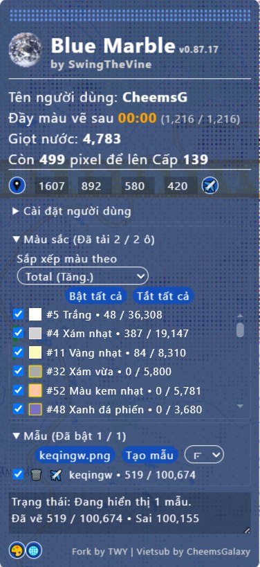

# 🇻🇳 Blue Marble Mod - Bản dịch tiếng Việt

Đây là phiên bản dịch tiếng Việt của **Blue Marble Mod** (bởi T-wy), được fork nhằm giúp người dùng Việt Nam tiếp cận dễ dàng hơn.

- **Bản dịch áp dụng cho nhánh `main`.** Các nhánh khác (ví dụ: `custom-improve`) giữ nguyên nội dung gốc.
- Nếu phát sinh lỗi trong quá trình sử dụng, vui lòng báo lại cho tôi qua GitHub: [CheemsGalaxy](https://github.com/CheemsGalaxy)

Cảm ơn các bạn đã quan tâm! 🚀

---

Hình ảnh xem trước của [Custom-Improve Branch](https://github.com/CheemsGalaxy/BlueMarble-Userscripts-Vietsub/tree/custom-improve) của Fork này:

| Bản mẫu | Lớp phủ |
|-|-|
|  |  |

| Thông tin Pixel | Xuất Bản đồ (Từ Hộp thoại Chia sẻ) |
|-|-|
|Wplace 1.1.1 ~ Hiện tại:  Wplace 1.1.0:  Wplace 1.0.0:  | 

Thêm thông tin về Fork này **[Tại đây](#regarding-this-fork)**.

**📥 Cài đặt một lần:**

| Phiên bản | Tải xuống |
|-----------|-----------|
| 🇻🇳 Bản Vietsub (CheemsGalaxy) | [Tải về](https://raw.githubusercontent.com/CheemsGalaxy/BlueMarble-Userscripts-Vietsub/main/dist/BlueMarbleVietsub.user.js) |
| 🔧 Bản mod (T-wy) | [Tải về](https://raw.githubusercontent.com/t-wy/Wplace-BlueMarble-Userscripts/main/dist/BlueMarble.user.js) |
| 📦 Bản Gốc (SwingTheVine) | [Tải về](https://raw.githubusercontent.com/SwingTheVine/Wplace-BlueMarble/main/dist/BlueMarble.user.js) |
| 🌙 Bản Nightly (Phát triển) | [Tải về](https://raw.githubusercontent.com/CheemsGalaxy/BlueMarble-Userscripts-Vietsub/main/dist/BlueMarbleVietsub.user.nightly.js) |
| 📑 Bookmarklet | [Tải về](/dist/BlueMarble.bookmarklet.min.js) |

<table>
  <tr>
    <td><a href="#blue-marble">Blue Marble</a></td>
    <td valign="top" rowspan="99"></td>
  </tr>
  <tr>
    <td>&emsp;<a href="#installation-instructions">Hướng dẫn cài đặt</a></td>
  </tr>
  <tr>
    <td>&emsp;<a href="#quick-guide">Hướng dẫn nhanh</a></td>
  </tr>
  <tr>
    <td>&emsp;<a href="#regarding-this-fork">Về fork này</a></td>
  </tr>
  <tr>
    <td>&emsp;<a href="#overview">Tổng quan</a></td>
  </tr>
  <tr>
    <td>&emsp;&emsp;<a href="#script-settings">Cài đặt tập lệnh</a></td>
  </tr>
  <tr>
    <td>&emsp;&emsp;<a href="#template-settings">Cài đặt bản mẫu</a></td>
  </tr>
  <tr>
    <td>&emsp;<a href="#how-versioning-works">Cách thức hoạt động của phiên bản</a></td>
  </tr>
  <tr>
    <td>&emsp;<a href="#licenses">Giấy phép</a></td>
  </tr>
  <tr>
    <td>&emsp;<a href="#faq">Câu hỏi thường gặp</a></td>
  </tr>
  <tr>
    <td>&emsp;&emsp;<a href="#how-do-i-hide-the-overlay">Làm thế nào để ẩn lớp phủ?</a></td>
  </tr>
  <tr>
    <td>&emsp;&emsp;<a href="#how-can-blue-marble-place-pixels-for-me">Blue Marble có thể đặt pixel cho tôi bằng cách nào?</a></td>
  </tr>
  <tr>
    <td>&emsp;&emsp;<a href="#is-blue-marble-malware">Blue Marble có phải là phần mềm độc hại không?</a></td>
  </tr>
  <tr>
    <td>&emsp;&emsp;<a href="#why-do-game-notifications-appear-on-top-of-the-overlay">Tại sao thông báo trò chơi xuất hiện trên lớp phủ?</a></td>
  </tr>
  <tr>
    <td>&emsp;<a href="#commitment">📝 Cam kết</a></td>
  </tr>
</table>

<h1 id="blue-marble">Blue Marble</h1>

<h2 id="installation-instructions">Hướng dẫn cài đặt</h2>

  Blue Marble đã được xác minh hoạt động trên thiết bị di động. Blue Marble được thiết kế trên Chrome, nhưng Blue Marble có thể hoạt động trên các trình duyệt "không được hỗ trợ" không được liệt kê ở trên. Một số phiên bản/nhánh của Firefox hoạt động. Một số phiên bản/nhánh của Firefox không hoạt động.
   
  Hướng dẫn cài đặt cho Blue Marble ở bên dưới. Nhấp vào mũi tên để mở rộng hướng dẫn bạn muốn xem. Văn bản màu xanh là liên kết.
  

    

      <b>Cài đặt trên Chrome</b> (Nhấp để mở rộng)
    

    
    <ol>
      <li>Cài đặt tiện ích mở rộng <a href="https://chromewebstore.google.com/detail/tampermonkey/dhdgffkkebhmkfjojejmpbldmpobfkfo" target="_blank" rel="noopener noreferrer">TamperMonkey</a> cho Chrome.
       
      </li>
      <li>Nhấp chuột phải vào tiện ích mở rộng.
       
      </li>
      <li>Nhấp chuột trái vào "Manage Extension".</li>
      <li>Bật "Developer Mode".
       
      </li>
      <li>Bật "Allow user scripts".</li>
      <li><strong>Cài đặt một lần:</strong> Nhấp vào liên kết này để cài đặt Blue Marble trực tiếp: <a href="https://raw.githubusercontent.com/CheemsGalaxy/BlueMarble-Userscripts-Vietsub/main/dist/BlueMarbleVietsub.user.js" target="_blank" rel="noopener noreferrer"><strong>Cài đặt Blue Marble</strong></a>
       
      TamperMonkey sẽ tự động phát hiện userscript và nhắc bạn cài đặt nó.</li>
      <li>Làm mới trang web <a href="https://wplace.live/" target="_blank" rel="noopener noreferrer">wplace.live</a>.</li>
    </ol>
  

  

    

      <b>Cài đặt trên Microsoft Edge</b> (Nhấp để mở rộng)
    

    <ol>
      <li>Cài đặt tiện ích bổ sung <a href="https://microsoftedge.microsoft.com/addons/detail/iikmkjmpaadaobahmlepeloendndfphd" target="_blank" rel="noopener noreferrer">TamperMonkey</a> cho Microsoft Edge.
       
      </li>
      <li>Nhấp chuột phải vào tiện ích mở rộng.
       
      </li>
      <li>Nhấp chuột trái vào "Manage Extension".</li>
      <li>Bật "Developer Mode".
       
      </li>
      <li>Tải xuống tệp <a href="https://raw.githubusercontent.com/CheemsGalaxy/BlueMarble-Userscripts-Vietsub/main/dist/BlueMarbleVietsub.user.js" target="_blank" rel="noopener noreferrer">BlueMarble.user.js</a> (bản mới nhất).</li>
      <li>Mở Bảng điều khiển TamperMonkey.
       
      </li>
      <li>Kéo tệp <code>BlueMarble.user.js</code> vào bên trong bảng điều khiển của TamperMonkey.
       
      </li>
      <li>Nhấp vào nút "Install" để cài đặt Blue Marble.
       
      </li>
      <li>Bật Blue Marble trong bảng điều khiển TamperMonkey.
       
      </li>
      <li>Làm mới trang web <a href="https://wplace.live/" target="_blank" rel="noopener noreferrer">wplace.live</a>.</li>
    </ol>
  

  

    

      <b>Cài đặt trên Firefox</b> (Nhấp để mở rộng)
    

    <ol>
      <li>Cài đặt tiện ích bổ sung <a href="https://addons.mozilla.org/en-US/firefox/addon/tampermonkey/" target="_blank" rel="noopener noreferrer">TamperMonkey</a> cho Firefox.
       
      </li>
      <li><strong>Cài đặt một lần:</strong> Nhấp vào liên kết này để cài đặt Blue Marble trực tiếp: <a href="https://raw.githubusercontent.com/CheemsGalaxy/BlueMarble-Userscripts-Vietsub/main/dist/BlueMarbleVietsub.user.js" target="_blank" rel="noopener noreferrer"><strong>Cài đặt Blue Marble</strong></a>
       
      TamperMonkey sẽ tự động phát hiện userscript và nhắc bạn cài đặt nó.</li>
      <li>Làm mới trang web <a href="https://wplace.live/" target="_blank" rel="noopener noreferrer">wplace.live</a>.</li>
    </ol>
  

  

    

      <b>Cài đặt trên Safari bằng Userscripts thay vì TamperMonkey</b> (Nhấp để mở rộng)
    

    <ol>
      <li>Cài đặt ứng dụng <a href="https://apps.apple.com/us/app/userscripts/id1463298887" target="_blank" rel="noopener noreferrer">Userscripts</a> từ App Store.
       
      Đảm bảo rằng các quyền thích hợp đã được cấp cho ứng dụng và Safari được cấu hình để bật tiện ích mở rộng.</li>
       
      <li>Tải xuống tập lệnh Blue Marble và lưu vào Vị trí Lưu theo quy định của ứng dụng: <a href="https://raw.githubusercontent.com/CheemsGalaxy/BlueMarble-Userscripts-Vietsub/main/dist/BlueMarbleVietsub.user.js" target="_blank" rel="noopener noreferrer"><strong>Tải xuống Blue Marble</strong></a>
       
      Userscripts sẽ tự động phát hiện userscript.</li>
      <li>Làm mới trang web <a href="https://wplace.live/" target="_blank" rel="noopener noreferrer">wplace.live</a>.</li>
      <li>Các vấn đề liên quan đến Cài đặt và Sử dụng Userscripts nên tham khảo: <a href="https://github.com/quoid/userscripts/" target="_blank" rel="noopener noreferrer"><strong>Kho lưu trữ của Userscripts</strong></a> thay vào đó.</li>
    </ol>
  

<h2 id="quick-guide">Hướng dẫn nhanh</h2>

  Nhấn các mũi tên để hiển thị tùy chọn bạn muốn.
  

    

      <b>Tôi muốn tải Blue Marble.</b> (Nhấp để mở rộng)
    

    <a href="#installation-instructions">Nhấp vào đây</a> để xem hướng dẫn cài đặt.
  

  

    

      <b>Tôi muốn đặt câu hỏi về Blue Marble.</b> (Nhấp để mở rộng)
    

    <a href="https://discord.gg/tpeBPy46hf" target="_blank" rel="noopener noreferrer">Nhấp vào đây</a> để nhận lời mời tham gia máy chủ Discord của máy chủ hỗ trợ Blue Marble.
     
    <a href="https://github.com/CheemsGalaxy/BlueMarble-Userscripts-Vietsub/discussions/categories/q-a">Nhấp vào đây</a> để đến trang trợ giúp và câu hỏi GitHub của Blue Marble.
  

  

    

      <b>Tôi muốn báo lỗi.</b> (Nhấp để mở rộng)
    

    <a href="https://github.com/CheemsGalaxy/BlueMarble-Userscripts-Vietsub/issues/new/choose">Nhấp vào đây</a> để báo lỗi, sau đó chọn tùy chọn "Bug Report".
  

  

    

      <b>Tôi muốn đề xuất tính năng.</b> (Nhấp để mở rộng)
    

    <a href="https://github.com/CheemsGalaxy/BlueMarble-Userscripts-Vietsub/issues/new/choose">Nhấp vào đây</a> để đề xuất tính năng, sau đó chọn tùy chọn "Feature Request".
  

  

    

      <b>Tôi muốn đóng góp.</b> (Nhấp để mở rộng)
    

    <a href="https://github.com/CheemsGalaxy/BlueMarble-Userscripts-Vietsub/blob/main/docs/CONTRIBUTING.md">Nhấp vào đây</a> để đọc các hướng dẫn đóng góp.
  

  

    

      <b>Tôi muốn báo cáo lỗ hổng.</b> (Nhấp để mở rộng)
    

    <a href="https://github.com/CheemsGalaxy/BlueMarble-Userscripts-Vietsub/security">Nhấp vào đây</a> để gửi báo cáo lỗ hổng.
  

  

    

      <b>Tôi muốn truy cập trang web.</b> (Nhấp để mở rộng)
    

    <a href="https://bluemarble.lol/" target="_blank" rel="noopener noreferrer">Nhấp vào đây</a> để truy cập trang web chính thức của Blue Marble.
  

<h2 id="regarding-this-fork">Về fork này</h2>

  Đối với những người dùng không muốn mua ứng dụng TamperMonkey từ App Store, vốn là ứng dụng trả phí không giống như các nền tảng trình duyệt khác, ứng dụng Userscripts dường như là một lựa chọn thay thế miễn phí làm trình quản lý userscript.

  Tuy nhiên, GM API được Userscripts hỗ trợ ít hơn nhiều so với những gì TamperMonkey hỗ trợ, đặc biệt là đối với các API đồng bộ cũ mà Blue Marble sử dụng đã bị Greasemonkey loại bỏ trong Greasemonkey 4.0+ và phải được thay thế bằng các lựa chọn thay thế:

<ul>
  <li>GM_addStyle → GM.addStyle</li>
  <li>GM_getValue → GM.getValue</li>
  <li>GM_getResourceText → Đã thay thế (GM.getResourceText không tồn tại)</li>
</ul>

  Kiểm tra <a href="https://github.com/CheemsGalaxy/BlueMarble-Userscripts-Vietsub/tree/custom-improve">Custom-Improve Branch</a> để biết các tính năng và cải tiến bổ sung được triển khai chưa có trong kho lưu trữ gốc:

<ul>
  <li><strong>UI/UX Cải tiến:</strong>
    <ul>
      <li>Hiển thị số lượng Charge bên ngoài nút có thể bị Cloudflare Turnstile che khuất. (v0.85.3)</li>
      <li>Hiển thị thời gian còn lại để đầy Charge. (v0.85.9)</li>
      <li>Hiển thị gợi ý bảng màu dưới dạng hình chữ thập thay vì dấu chấm để dễ nhìn hơn. (v0.85.2) <em>(Có thể khôi phục về chế độ dấu chấm kể từ v0.85.46)</em></li>
      <li>Hiển thị số lượng đã lấp đầy của từng màu. (v0.85.10)</li>
      <li>Thanh tiến trình phía sau mỗi màu trong danh sách hiển thị tiến độ tương đối. (v0.85.24)</li>
      <li>Hiển thị cả tọa độ địa lý cùng với tọa độ ô. (v0.85.5)</li>
      <li>Cho phép đổi tên bản mẫu bằng cách nhấp vào tên bản mẫu. (v0.86.1)</li>
    </ul>
  </li>
  <li><strong>Hiệu suất & Tối ưu:</strong>
    <ul>
      <li>Ghi nhớ các ô đã tải để tránh độ trễ / tính toán dư thừa (bất cứ khi nào tiêu đề Last-Modified không thay đổi) (v0.85.4)</li>
      <li>Tối ưu hóa vòng lặp for để phản hồi nhanh hơn. (v0.85.7)</li>
      <li>Chế độ Tiết kiệm bộ nhớ: Tạo ImageBitmap chỉ khi các bản mẫu được xử lý và giải phóng ngay sau đó để ngăn sử dụng hết tất cả bộ nhớ khả dụng. (v0.85.33)</li>
      <li>Lớp phủ không còn đợi fetch để cập nhật. (v0.86.1)</li>
      <li>Cho phép bản mẫu không tạo lớp phủ trên bản đồ để tiết kiệm thời gian xử lý. (v0.87.15)</li>
    </ul>
  </li>
  <li><strong>Tính năng mới:</strong>
    <ul>
      <li>Dịch chuyển trực tiếp đến một trong các pixel chưa được lấp đầy khi nhấp vào khối màu chưa hoàn thành trong bộ lọc. (v0.85.10)</li>
      <li>Cho phép dịch chuyển đến tọa độ ô đã cho qua nút máy bay bên cạnh các hộp nhập liệu. (v0.85.9)</li>
      <li>Cho phép sử dụng nhiều bản mẫu cùng một lúc. (v0.85.11)</li>
      <li>Nút để dịch chuyển đến góc trên cùng bên trái của bản mẫu đã chọn. (v0.85.12)</li>
      <li>Các tùy chọn khác nhau để thay đổi thứ tự hiển thị của các màu, bao gồm số lượng đã/chưa tô, sắc độ và độ sáng. (v0.85.23) <em>(Đã thêm tùy chọn sắp xếp theo ID màu ở v0.87.16)</em></li>
      <li>Cho phép các định dạng tọa độ khác nhau (`a, b, c, d`, `a b c d` và `Tl X: a, Tl Y: b, Px X: c, Px Y: d`) được dán vào hộp văn bản tọa độ đầu tiên. (v0.85.28)</li>
      <li>Cho phép tải xuống tác phẩm nghệ thuật (theo đúng kích thước) từ bản đồ qua Nút Chia sẻ bằng hai tọa độ của các góc đối diện. (v0.85.28)</li>
      <li>Cho phép đặt điểm neo cho tọa độ được chỉ định để đặt bản mẫu. (v0.85.34)</li>
      <li>Hỗ trợ hiển thị vị trí của các Vật phẩm Sự kiện. (v0.85.35)</li>
      <li>Cho phép chỉ hiển thị các pixel của màu hiện được chọn trong Wplace một cách tự động. (v0.85.37)</li>
      <li>Chuyển đổi giữa các chủ đề tích hợp sẵn của Wplace. (v0.85.40)</li>
      <li>Kiểm tra tính năng bản đồ lỗi (Đỏ: Sai, Vàng: Chưa lấp đầy, Xanh lá: Đúng). (v0.85.46)</li>
      <li>Tách lớp phủ và lớp lỗi khỏi lớp tác phẩm nghệ thuật. (v0.86.1)</li>
      <li>Cho phép cuộn bản đồ theo đường chéo mượt mà qua bàn phím bằng các phím mũi tên (<kbd>W</kbd> <kbd>A</kbd> <kbd>S</kbd> <kbd>D</kbd>). (v0.86.5) <em>(Được triển khai bởi <a href="https://github.com/due2e">@due2e</a>)</em></li>
      <li>Hiển thị thời gian đếm ngược tạm ngưng và lý do nếu có. (v0.86.6)</li>
      <li>Hiển thị các nút tỷ lệ thu phóng bổ sung để cho phép ảnh chụp màn hình có cùng kích thước pixel chính xác. (v0.86.10) <em>(Được mở rộng bởi <a href="https://github.com/Commenter25">@Commenter25</a>)</em></li>
      <li>Cho phép tạo bản mẫu đường thẳng / hình tròn của màu hiện được chọn. (v0.86.13)</li>
    </ul>
  </li>
  <li><strong>Sửa lỗi:</strong>
    <ul>
      <li>Đã sửa lỗi chuyển đổi bảng màu không lưu trữ được. (v0.85.1)</li>
      <li>Đã sửa lỗi số lượng tổng số khối cần đếm là 1 hoặc 2 sau khi làm mới. (v0.85.2)</li>
      <li>Đã sửa lỗi các nút "Bật tất cả" và "Tắt tất cả" không lưu trữ được. (v0.85.13)</li>
      <li>Đã sửa lỗi chuyển đổi không gian màu trên Firefox. (v0.85.16)</li>
      <li>Thêm tùy chọn để chỉ cho phép các màu hiện đang được bật được bao gồm trong bản đồ lỗi. (v0.86.14)</li>
      <li>Sửa một số vấn đề về ranh giới từ thượng nguồn Blue Marble và Wplace. (v0.86.16)</li>
    </ul>
  </li>
  <li><strong>Hỗ trợ & Tiện ích:</strong>
    <ul>
      <li>Tùy chọn ẩn các màu bị khóa (màu chưa được mở khóa) khỏi danh sách màu. (v0.85.17)</li>
      <li>Cung cấp phiên bản bookmarklet. (v0.85.22)</li>
      <li>Cho phép ẩn các
